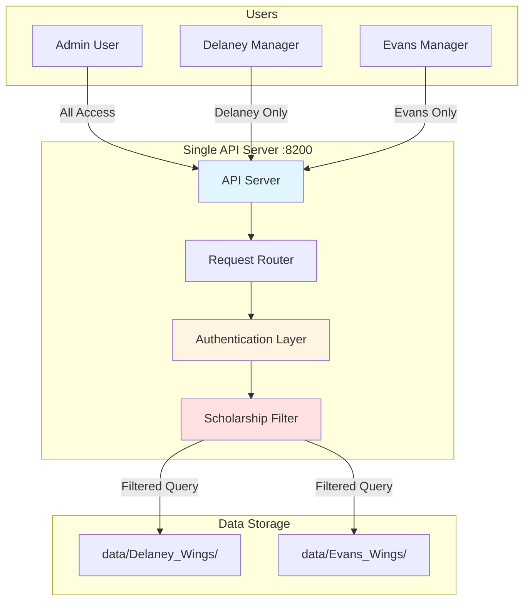
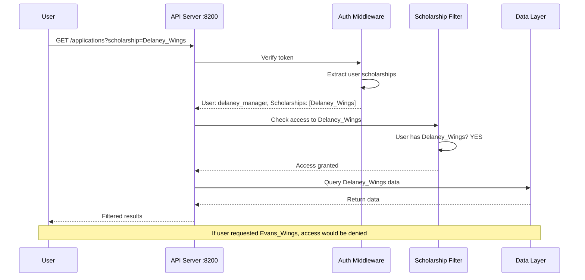
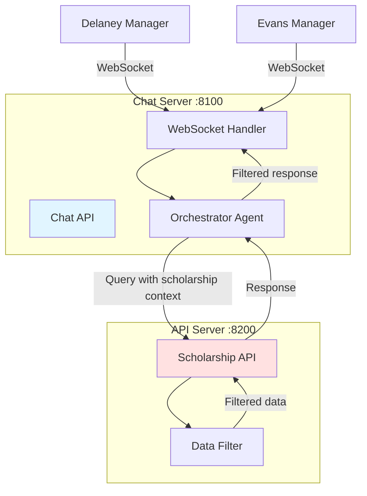
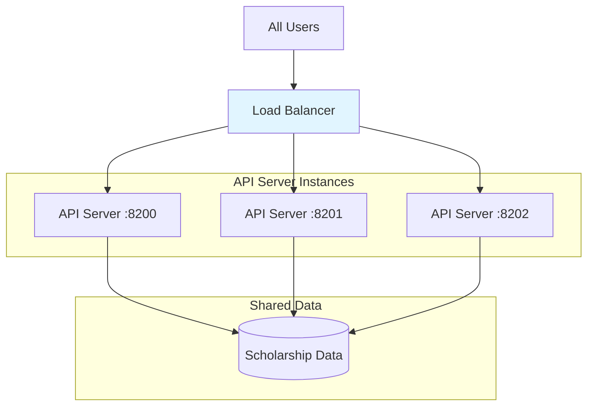

# API Server Architecture for Multi-Tenancy

## Overview

The multi-tenancy design uses a **single shared API server** (running on port 8200) that serves all scholarships. Data isolation is achieved through **request-level filtering** based on the authenticated user's scholarship assignments, NOT by running separate server instances.

## Single Server Architecture



## How It Works

### 1. Single Server Instance

**One API server serves all scholarships:**
- Runs on a single port (e.g., 8200)
- Handles requests from all users
- Manages all scholarship data
- Uses middleware to filter responses

### 2. Request Flow with Filtering



### 3. Data Isolation Mechanism

**Request-Level Filtering:**

```python
# Single API endpoint serves all scholarships
@app.get("/applications")
async def get_applications(
    scholarship: str,
    auth_token: str = Header(...)
):
    # 1. Verify user authentication
    token_data = verify_token(auth_token)
    
    # 2. Check scholarship access
    access_control = ScholarshipAccessMiddleware(token_data)
    if not access_control.can_access_scholarship(scholarship):
        raise HTTPException(403, "Access denied to this scholarship")
    
    # 3. Get data folder for scholarship
    data_folder = access_control.get_data_folder(scholarship)
    
    # 4. Query only from allowed folder
    applications = load_applications(data_folder)
    
    return applications
```

## Why Single Server?

### Advantages

1. **Simplified Operations**
   - One server to deploy and maintain
   - Single configuration file
   - Centralized logging and monitoring
   - Easier updates and patches

2. **Resource Efficiency**
   - Shared memory and CPU
   - Lower infrastructure costs
   - Better resource utilization
   - Easier scaling (horizontal or vertical)

3. **Consistent Experience**
   - Same API version for all users
   - Unified authentication
   - Centralized audit logging
   - Consistent performance

4. **Easier Development**
   - Single codebase
   - Shared utilities and libraries
   - Simpler testing
   - Faster feature deployment

### Comparison: Single vs Multiple Servers

| Aspect | Single Server (Recommended) | Multiple Servers |
|--------|---------------------------|------------------|
| **Deployment** | Deploy once | Deploy N times (one per scholarship) |
| **Configuration** | One config file | N config files |
| **Maintenance** | Update once | Update N times |
| **Resources** | Shared, efficient | Duplicated, wasteful |
| **Monitoring** | One dashboard | N dashboards |
| **Costs** | Lower | Higher (N × cost) |
| **Complexity** | Low | High |
| **Data Isolation** | Middleware filtering | Network isolation |
| **Security** | Application-level | Network-level |

## API Server Configuration

### Single Server Setup

```yaml
# config/api_server.yaml
server:
  host: "0.0.0.0"
  port: 8200
  workers: 4  # Handles all scholarships

scholarships:
  - name: "Delaney_Wings"
    data_folder: "data/Delaney_Wings"
    enabled: true
  
  - name: "Evans_Wings"
    data_folder: "data/Evans_Wings"
    enabled: true

# All scholarships share the same server instance
```

### Environment Variables

```bash
# Single API server configuration
API_SERVER_URL="http://localhost:8200"
API_SERVER_PORT=8200
API_SERVER_WORKERS=4

# Data folders (all served by same server)
DELANEY_WINGS_FOLDER=data/Delaney_Wings
EVANS_WINGS_FOLDER=data/Evans_Wings
```

## Request Examples

### Admin User (Access All Scholarships)

```bash
# Admin can query any scholarship
curl -H "Authorization: Bearer admin_token" \
  http://localhost:8200/applications?scholarship=Delaney_Wings

curl -H "Authorization: Bearer admin_token" \
  http://localhost:8200/applications?scholarship=Evans_Wings

# Both requests succeed
```

### Delaney Manager (Access Only Delaney)

```bash
# Can access Delaney
curl -H "Authorization: Bearer delaney_token" \
  http://localhost:8200/applications?scholarship=Delaney_Wings
# ✓ Success: Returns Delaney applications

# Cannot access Evans
curl -H "Authorization: Bearer delaney_token" \
  http://localhost:8200/applications?scholarship=Evans_Wings
# ✗ Error 403: Access denied to this scholarship
```

## API Endpoint Design

### Scholarship-Aware Endpoints

All endpoints include scholarship context:

```python
# Pattern 1: Scholarship as query parameter
GET /applications?scholarship=Delaney_Wings
GET /top_scores?scholarship=Delaney_Wings&limit=10

# Pattern 2: Scholarship in path
GET /scholarships/Delaney_Wings/applications
GET /scholarships/Evans_Wings/top_scores

# Pattern 3: Scholarship in header (for bulk operations)
GET /applications
Header: X-Scholarship: Delaney_Wings
```

### Automatic Filtering

```python
@app.get("/applications")
async def get_applications(
    scholarship: str = Query(...),
    limit: int = Query(100),
    auth_token: str = Header(...)
):
    """
    Single endpoint serves all scholarships.
    Filtering happens automatically based on user's access.
    """
    token_data = verify_token(auth_token)
    access_control = ScholarshipAccessMiddleware(token_data)
    
    # Automatic access check
    if not access_control.can_access_scholarship(scholarship):
        raise HTTPException(403, "Access denied")
    
    # Query only allowed data
    data_folder = access_control.get_data_folder(scholarship)
    return query_applications(data_folder, limit)
```

## Chat API Integration

### Single Chat Server with Multi-Tenancy



### Chat-to-API Communication

```python
# Chat server (port 8100) calls API server (port 8200)
async def query_scholarship_data(scholarship: str, token_data: dict):
    """
    Chat server makes authenticated requests to API server.
    API server filters data based on user's scholarship access.
    """
    access_control = ScholarshipAccessMiddleware(token_data)
    
    if not access_control.can_access_scholarship(scholarship):
        return {"error": "Access denied to this scholarship"}
    
    # Call API server with scholarship context
    response = await http_client.get(
        f"{API_SERVER_URL}/applications",
        params={"scholarship": scholarship},
        headers={"Authorization": f"Bearer {token_data['token']}"}
    )
    
    return response.json()
```

## Scaling Considerations

### Horizontal Scaling (Multiple Instances)

If you need to scale, you can run multiple instances of the **same** server:



**Key Points:**
- All instances run the **same code**
- All instances access the **same data**
- Load balancer distributes requests
- Each instance filters based on user context

### Vertical Scaling

```bash
# Increase resources for single server
API_SERVER_WORKERS=8  # More workers
API_SERVER_MEMORY=4GB # More memory
```

## Security Implications

### Single Server Security

**Advantages:**
- Centralized security controls
- Single point for security updates
- Unified authentication
- Consistent audit logging

**Considerations:**
- Must ensure proper access control
- Middleware must be bulletproof
- Regular security audits
- Comprehensive testing

### Security Layers

```
┌─────────────────────────────────────┐
│ 1. Network Security (Firewall)     │
├─────────────────────────────────────┤
│ 2. TLS/HTTPS Encryption             │
├─────────────────────────────────────┤
│ 3. Authentication (Token)           │
├─────────────────────────────────────┤
│ 4. Authorization (Middleware)       │
├─────────────────────────────────────┤
│ 5. Data Filtering (Query Level)     │
├─────────────────────────────────────┤
│ 6. Path Validation (File System)    │
├─────────────────────────────────────┤
│ 7. Audit Logging (All Access)       │
└─────────────────────────────────────┘
```

## Performance Optimization

### Caching Strategy

```python
# Single server can cache data for all scholarships
from functools import lru_cache

@lru_cache(maxsize=100)
def get_scholarship_config(scholarship: str) -> dict:
    """Cache scholarship configuration"""
    config = load_user_config()
    return config["scholarships"][scholarship]

@lru_cache(maxsize=1000)
def get_application_summary(scholarship: str, app_id: str) -> dict:
    """Cache application summaries"""
    return load_application(scholarship, app_id)
```

### Connection Pooling

```python
# Single server maintains connection pools
class APIServer:
    def __init__(self):
        # Shared connection pool for all scholarships
        self.db_pool = create_connection_pool(max_connections=50)
        self.cache = create_cache(max_size=1000)
    
    async def query_data(self, scholarship: str, query: str):
        # Use shared resources efficiently
        async with self.db_pool.acquire() as conn:
            # Filter by scholarship
            return await conn.fetch(query, scholarship=scholarship)
```

## Monitoring and Observability

### Single Dashboard

```yaml
# Monitoring configuration for single server
metrics:
  - name: "requests_per_scholarship"
    type: "counter"
    labels: ["scholarship", "user_role"]
  
  - name: "response_time_per_scholarship"
    type: "histogram"
    labels: ["scholarship", "endpoint"]
  
  - name: "access_denials"
    type: "counter"
    labels: ["scholarship", "user", "reason"]
```

### Logging

```python
# Centralized logging for all scholarships
logger.info(
    "API request",
    extra={
        "scholarship": scholarship,
        "user": username,
        "role": role,
        "endpoint": endpoint,
        "response_time": response_time
    }
)
```

## Migration Path

### From Current Setup to Multi-Tenancy

```bash
# No server changes needed!
# Just add filtering to existing server

# Before: Single server, no filtering
GET /applications  # Returns all applications

# After: Single server, with filtering
GET /applications?scholarship=Delaney_Wings  # Returns only Delaney
```

## Summary

**Single API Server Approach:**

✅ **Recommended** - Use one API server with request-level filtering
- Simpler to deploy and maintain
- More resource efficient
- Easier to scale
- Centralized security and monitoring
- Lower operational costs

❌ **Not Recommended** - Multiple API servers (one per scholarship)
- Complex deployment
- Resource duplication
- Higher costs
- Difficult to maintain
- Inconsistent versions

**The key insight:** Multi-tenancy is achieved through **software-level isolation** (middleware and filtering), not **infrastructure-level isolation** (separate servers).