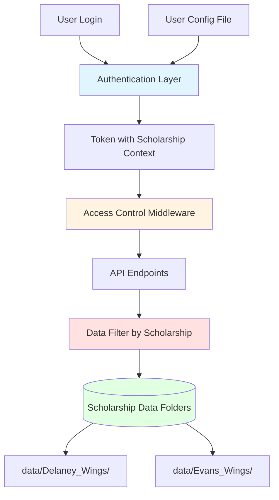
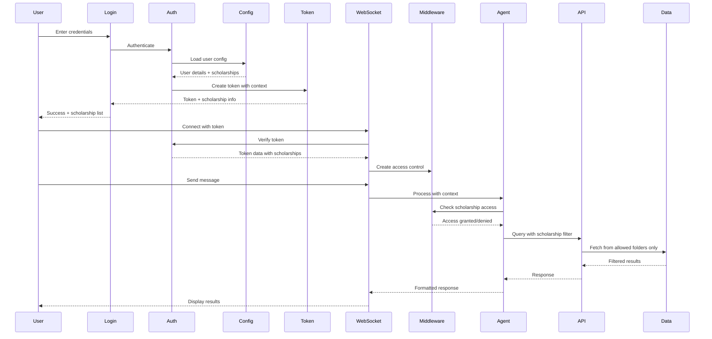

# Multi-Tenancy Design for Scholarship Management System

## Overview

This document outlines the design for implementing organization-based multi-tenancy in the scholarship management system, where users are assigned to specific scholarship organizations (e.g., Delaney_Wings, Evans_Wings) and can only access data for their assigned scholarship.

## Architecture Design

### 1. Core Principles

- **Organization-Based Isolation**: Each scholarship organization has its own data folder
- **Simple Configuration**: User-to-scholarship mapping stored in configuration files
- **Backward Compatible**: Extends existing token-based authentication
- **Data Security**: Complete data isolation between organizations
- **Audit Trail**: All access attempts logged for security

### 2. System Architecture



### 3. Data Model

#### User Configuration Schema

```json
{
  "users": {
    "admin": {
      "password_env": "ADMIN_PASSWORD",
      "role": "admin",
      "scholarships": ["*"],
      "permissions": ["read", "write", "admin"]
    },
    "delaney_manager": {
      "password_env": "DELANEY_PASSWORD",
      "role": "manager",
      "scholarships": ["Delaney_Wings"],
      "permissions": ["read", "write"]
    },
    "evans_manager": {
      "password_env": "EVANS_PASSWORD",
      "role": "manager",
      "scholarships": ["Evans_Wings"],
      "permissions": ["read", "write"]
    },
    "reviewer_delaney": {
      "password_env": "REVIEWER_DELANEY_PASSWORD",
      "role": "reviewer",
      "scholarships": ["Delaney_Wings"],
      "permissions": ["read"]
    }
  },
  "scholarships": {
    "Delaney_Wings": {
      "name": "Delaney Wings Scholarship",
      "data_folder": "data/Delaney_Wings",
      "enabled": true
    },
    "Evans_Wings": {
      "name": "Evans Wings Scholarship",
      "data_folder": "data/Evans_Wings",
      "enabled": true
    }
  }
}
```

#### Enhanced Token Structure

```python
{
    "username": "delaney_manager",
    "role": "manager",
    "scholarships": ["Delaney_Wings"],
    "permissions": ["read", "write"],
    "created": "2025-12-09T21:00:00Z",
    "expires": "2025-12-10T21:00:00Z"
}
```

### 4. Component Design

#### 4.1 Enhanced Authentication Module

**File**: `bee_agents/auth.py`

**New Functions**:
```python
def load_user_config() -> dict:
    """Load user configuration from JSON file"""
    
def get_user_scholarships(username: str) -> list[str]:
    """Get list of scholarships assigned to user"""
    
def get_user_role(username: str) -> str:
    """Get user role (admin, manager, reviewer)"""
    
def get_user_permissions(username: str) -> list[str]:
    """Get user permissions"""
    
def has_scholarship_access(username: str, scholarship: str) -> bool:
    """Check if user has access to specific scholarship"""
```

**Enhanced Token Creation**:
```python
def create_token(username: str) -> dict:
    """Create token with scholarship context"""
    user_config = load_user_config()
    user = user_config["users"][username]
    
    token = secrets.token_urlsafe(32)
    active_tokens[token] = {
        "username": username,
        "role": user["role"],
        "scholarships": user["scholarships"],
        "permissions": user["permissions"],
        "created": datetime.now()
    }
    return {
        "token": token,
        "username": username,
        "scholarships": user["scholarships"],
        "role": user["role"]
    }
```

#### 4.2 Access Control Middleware

**File**: `bee_agents/middleware.py` (new)

```python
class ScholarshipAccessMiddleware:
    """Middleware to enforce scholarship-based access control"""
    
    def __init__(self, token_data: dict):
        self.username = token_data["username"]
        self.role = token_data["role"]
        self.scholarships = token_data["scholarships"]
        self.permissions = token_data["permissions"]
    
    def can_access_scholarship(self, scholarship: str) -> bool:
        """Check if user can access scholarship"""
        if "*" in self.scholarships:  # Admin access
            return True
        return scholarship in self.scholarships
    
    def filter_scholarships(self, scholarships: list[str]) -> list[str]:
        """Filter scholarship list based on user access"""
        if "*" in self.scholarships:
            return scholarships
        return [s for s in scholarships if s in self.scholarships]
    
    def get_data_folder(self, scholarship: str) -> str:
        """Get data folder path for scholarship"""
        if not self.can_access_scholarship(scholarship):
            raise PermissionError(f"Access denied to {scholarship}")
        
        config = load_user_config()
        return config["scholarships"][scholarship]["data_folder"]
```

#### 4.3 API Endpoint Modifications

**File**: `bee_agents/chat_api.py`

**Changes Required**:

1. **WebSocket Authentication Enhancement**:
```python
async def authenticate_websocket(websocket: WebSocket) -> dict:
    """Authenticate WebSocket and return full token data"""
    cookie_header = websocket.headers.get("cookie", "")
    auth_token = extract_auth_token_from_cookies(cookie_header)
    token_data = verify_token_with_context(auth_token)
    
    if not token_data:
        await websocket.close(code=1008, reason="Unauthorized")
        return None
    
    return token_data
```

2. **Add Scholarship Context to Agent**:
```python
async def process_chat_message(
    websocket: WebSocket, 
    message_data: dict, 
    token_data: dict
) -> None:
    """Process message with scholarship context"""
    
    # Create middleware
    access_control = ScholarshipAccessMiddleware(token_data)
    
    # Add scholarship context to agent instructions
    scholarship_context = f"""
    User: {token_data['username']}
    Role: {token_data['role']}
    Assigned Scholarships: {', '.join(token_data['scholarships'])}
    
    You can only access data for the scholarships listed above.
    """
    
    # Pass context to agent
    response = await orchestrator_agent.run(
        user_message,
        context=scholarship_context,
        access_control=access_control
    )
```

#### 4.4 OpenAPI Tool Enhancement

**File**: `bee_agents/openapi_wrapper.py` (new)

```python
class ScholarshipAwareOpenAPITool:
    """Wrapper for OpenAPI tools with scholarship filtering"""
    
    def __init__(self, base_tool, access_control: ScholarshipAccessMiddleware):
        self.base_tool = base_tool
        self.access_control = access_control
    
    async def execute(self, **kwargs):
        """Execute tool with scholarship filtering"""
        
        # Add scholarship filter to API calls
        if "scholarship" in kwargs:
            if not self.access_control.can_access_scholarship(kwargs["scholarship"]):
                raise PermissionError("Access denied to this scholarship")
        
        # For endpoints that return multiple scholarships, filter results
        result = await self.base_tool.execute(**kwargs)
        
        if isinstance(result, list):
            result = self._filter_results(result)
        
        return result
    
    def _filter_results(self, results: list) -> list:
        """Filter results based on user's scholarship access"""
        filtered = []
        for item in results:
            if "scholarship" in item:
                if self.access_control.can_access_scholarship(item["scholarship"]):
                    filtered.append(item)
            else:
                filtered.append(item)
        return filtered
```

### 5. Implementation Flow



### 6. Security Considerations

#### 6.1 Access Control Rules

1. **Admin Role** (`scholarships: ["*"]`):
   - Can access all scholarships
   - Can view all data folders
   - Can manage users (future)

2. **Manager Role** (specific scholarships):
   - Can read and write to assigned scholarships only
   - Cannot see other scholarship data
   - Cannot access other scholarship folders

3. **Reviewer Role** (specific scholarships):
   - Read-only access to assigned scholarships
   - Cannot modify data
   - Cannot see other scholarship data

#### 6.2 Data Isolation

```python
# Example: Prevent path traversal attacks
def validate_scholarship_path(scholarship: str, requested_path: str) -> bool:
    """Ensure requested path is within scholarship folder"""
    scholarship_folder = get_scholarship_folder(scholarship)
    resolved_path = Path(requested_path).resolve()
    scholarship_path = Path(scholarship_folder).resolve()
    
    return resolved_path.is_relative_to(scholarship_path)
```

#### 6.3 Audit Logging

```python
def log_access_attempt(
    username: str,
    scholarship: str,
    action: str,
    allowed: bool,
    resource: str = None
):
    """Log all access attempts for audit trail"""
    logger.info(
        "Access attempt",
        extra={
            "username": username,
            "scholarship": scholarship,
            "action": action,
            "allowed": allowed,
            "resource": resource,
            "timestamp": datetime.now().isoformat()
        }
    )
```

### 7. Configuration Files

#### 7.1 User Configuration File

**Location**: `config/users.json`

```json
{
  "version": "1.0",
  "users": {
    "admin": {
      "password_env": "ADMIN_PASSWORD",
      "role": "admin",
      "scholarships": ["*"],
      "permissions": ["read", "write", "admin"],
      "email": "admin@example.com",
      "enabled": true
    },
    "delaney_manager": {
      "password_env": "DELANEY_PASSWORD",
      "role": "manager",
      "scholarships": ["Delaney_Wings"],
      "permissions": ["read", "write"],
      "email": "delaney@example.com",
      "enabled": true
    },
    "evans_manager": {
      "password_env": "EVANS_PASSWORD",
      "role": "manager",
      "scholarships": ["Evans_Wings"],
      "permissions": ["read", "write"],
      "email": "evans@example.com",
      "enabled": true
    }
  },
  "scholarships": {
    "Delaney_Wings": {
      "name": "Delaney Wings Scholarship",
      "short_name": "Delaney",
      "data_folder": "data/Delaney_Wings",
      "enabled": true,
      "description": "Delaney Wings Scholarship Program"
    },
    "Evans_Wings": {
      "name": "Evans Wings Scholarship",
      "short_name": "Evans",
      "data_folder": "data/Evans_Wings",
      "enabled": true,
      "description": "Evans Wings Scholarship Program"
    }
  }
}
```

#### 7.2 Environment Variables

**Add to `.env`**:
```bash
# User passwords
ADMIN_PASSWORD=secure_admin_password
DELANEY_PASSWORD=delaney_manager_password
EVANS_PASSWORD=evans_manager_password

# User configuration
USER_CONFIG_FILE=config/users.json

# Security settings
TOKEN_EXPIRY_HOURS=24
ENABLE_AUDIT_LOG=true
AUDIT_LOG_FILE=logs/access_audit.log
```

### 8. API Changes

#### 8.1 Enhanced Login Response

```json
{
  "token": "abc123...",
  "username": "delaney_manager",
  "role": "manager",
  "scholarships": [
    {
      "id": "Delaney_Wings",
      "name": "Delaney Wings Scholarship",
      "short_name": "Delaney"
    }
  ],
  "permissions": ["read", "write"]
}
```

#### 8.2 New Endpoints

1. **GET /api/user/scholarships**
   - Returns list of scholarships user can access
   - Includes scholarship details

2. **GET /api/user/profile**
   - Returns user profile with role and permissions
   - Shows assigned scholarships

3. **GET /api/scholarships** (filtered)
   - Returns only scholarships user has access to
   - Admin sees all, others see assigned only

### 9. UI Changes

#### 9.1 Login Page Enhancement

- Display scholarship assignment after successful login
- Show user role and permissions
- Redirect to appropriate dashboard based on role

#### 9.2 Chat Interface Enhancement

```html
<!-- Add scholarship context display -->
<div class="user-context">
  <span class="username">delaney_manager</span>
  <span class="role badge">Manager</span>
  <span class="scholarship badge">Delaney Wings</span>
</div>
```

#### 9.3 Navigation Updates

- Show only relevant scholarship data
- Hide admin features for non-admin users
- Display scholarship selector for admin users

### 10. Migration Path

#### Phase 1: Configuration Setup
1. Create `config/users.json`
2. Add new environment variables
3. Update `.env` with user passwords

#### Phase 2: Authentication Enhancement
1. Update `auth.py` with new functions
2. Add scholarship context to tokens
3. Implement backward compatibility

#### Phase 3: Middleware Implementation
1. Create `middleware.py`
2. Add access control checks
3. Implement audit logging

#### Phase 4: API Integration
1. Update WebSocket authentication
2. Add scholarship filtering to agents
3. Wrap OpenAPI tools with access control

#### Phase 5: UI Updates
1. Update login page
2. Add scholarship context to chat interface
3. Implement role-based UI elements

#### Phase 6: Testing & Deployment
1. Test with different user roles
2. Verify data isolation
3. Check audit logs
4. Deploy to production

### 11. Testing Strategy

#### 11.1 Unit Tests

```python
def test_scholarship_access():
    """Test scholarship access control"""
    # Test admin can access all
    # Test manager can access assigned only
    # Test reviewer has read-only access
    
def test_data_isolation():
    """Test data cannot leak between scholarships"""
    # Test path traversal prevention
    # Test API filtering
    
def test_token_context():
    """Test token includes scholarship context"""
    # Test token creation
    # Test token verification
```

#### 11.2 Integration Tests

```python
def test_end_to_end_access():
    """Test complete user flow"""
    # Login as manager
    # Query scholarship data
    # Verify only assigned data returned
    # Attempt to access other scholarship (should fail)
```

### 12. Future Enhancements

1. **Database-Backed User Management**
   - Move from JSON config to database
   - Add user CRUD operations
   - Implement user invitation system

2. **Fine-Grained Permissions**
   - Application-level permissions
   - Field-level access control
   - Time-based access restrictions

3. **Multi-Scholarship Support**
   - Allow users to manage multiple scholarships
   - Scholarship switching in UI
   - Cross-scholarship reporting (for admins)

4. **OAuth/SAML Integration**
   - Enterprise SSO support
   - LDAP integration
   - Multi-factor authentication

5. **Advanced Audit Features**
   - Real-time access monitoring
   - Compliance reporting
   - Anomaly detection

## Summary

This design provides a robust, scalable multi-tenancy solution that:

- ✅ Isolates scholarship data by organization
- ✅ Uses simple configuration files for user management
- ✅ Extends existing authentication without breaking changes
- ✅ Provides complete data security between scholarships
- ✅ Includes comprehensive audit logging
- ✅ Supports multiple user roles and permissions
- ✅ Scales to additional scholarships easily
- ✅ Maintains backward compatibility

The implementation follows security best practices and provides a clear migration path from the current system.