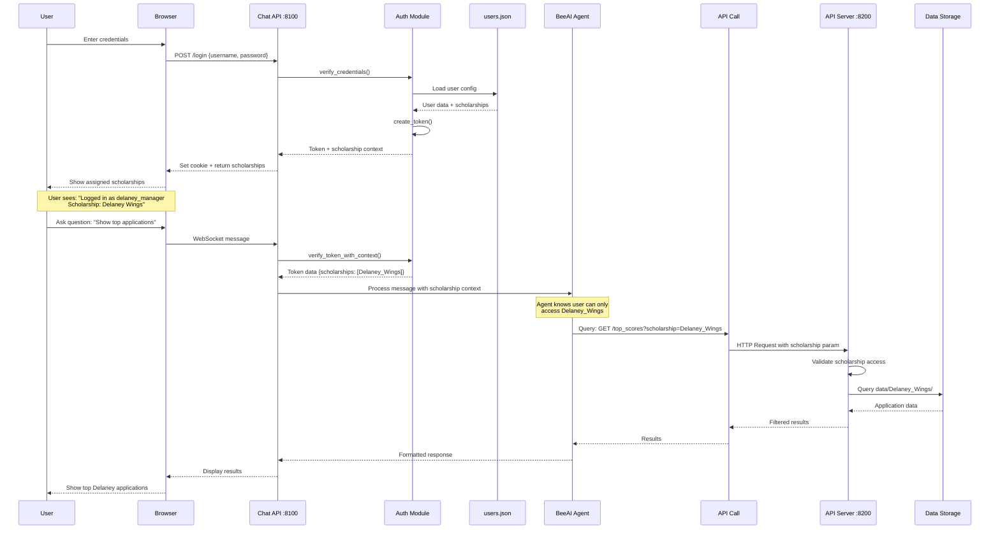

# Scholarship Context Flow: From User to API Server

## Overview

This document explains how scholarship information is passed through the system, from user login to API server queries.

## Complete Data Flow



## Three Methods to Pass Scholarship Information

### Method 1: Query Parameter (Recommended)

**Most Common Approach:**

```python
# Chat API calls API Server with scholarship in URL
GET http://localhost:8200/applications?scholarship=Delaney_Wings&limit=10
```

**Implementation:**

```python
# In Chat API (bee_agents/chat_api.py)
async def query_scholarship_data(token_data: dict, user_query: str):
    """
    Agent determines which scholarship to query based on:
    1. User's assigned scholarships from token
    2. User's question context
    """
    access_control = ScholarshipAccessMiddleware(token_data)
    
    # Get user's accessible scholarships
    scholarships = access_control.get_accessible_scholarships()
    
    # If user has only one scholarship, use it automatically
    if len(scholarships) == 1:
        scholarship = scholarships[0]["id"]
    else:
        # Admin or multi-scholarship user: determine from context
        scholarship = extract_scholarship_from_query(user_query, scholarships)
    
    # Make API call with scholarship parameter
    response = await http_client.get(
        f"{API_SERVER_URL}/applications",
        params={
            "scholarship": scholarship,
            "limit": 10
        }
    )
    
    return response.json()
```

**API Server receives and validates:**

```python
# In API Server
@app.get("/applications")
async def get_applications(
    scholarship: str = Query(..., description="Scholarship identifier"),
    limit: int = Query(10)
):
    """
    Scholarship is passed as query parameter.
    Server validates it exists and returns data.
    """
    # Validate scholarship exists
    if scholarship not in AVAILABLE_SCHOLARSHIPS:
        raise HTTPException(404, f"Scholarship not found: {scholarship}")
    
    # Get data folder for scholarship
    data_folder = f"data/{scholarship}"
    
    # Query and return data
    applications = load_applications(data_folder, limit)
    return applications
```

### Method 2: Path Parameter

**RESTful Approach:**

```python
# Scholarship in URL path
GET http://localhost:8200/scholarships/Delaney_Wings/applications
GET http://localhost:8200/scholarships/Evans_Wings/top_scores
```

**Implementation:**

```python
# API Server endpoint
@app.get("/scholarships/{scholarship}/applications")
async def get_scholarship_applications(
    scholarship: str,
    limit: int = Query(10)
):
    """Scholarship passed as path parameter"""
    if scholarship not in AVAILABLE_SCHOLARSHIPS:
        raise HTTPException(404, f"Scholarship not found: {scholarship}")
    
    data_folder = f"data/{scholarship}"
    return load_applications(data_folder, limit)
```

### Method 3: Request Header

**For Bulk Operations:**

```python
# Scholarship in custom header
GET http://localhost:8200/applications
Headers:
  X-Scholarship: Delaney_Wings
  Authorization: Bearer token123
```

**Implementation:**

```python
# API Server endpoint
@app.get("/applications")
async def get_applications(
    x_scholarship: str = Header(..., alias="X-Scholarship"),
    limit: int = Query(10)
):
    """Scholarship passed in header"""
    scholarship = x_scholarship
    
    if scholarship not in AVAILABLE_SCHOLARSHIPS:
        raise HTTPException(404, f"Scholarship not found: {scholarship}")
    
    data_folder = f"data/{scholarship}"
    return load_applications(data_folder, limit)
```

## Detailed Flow: Login to Query

### Step 1: User Login

**Request:**
```http
POST http://localhost:8100/login
Content-Type: application/json

{
  "username": "delaney_manager",
  "password": "secure_password"
}
```

**Processing:**
```python
# In bee_agents/chat_api.py
@app.post("/login")
async def login(request: LoginRequest):
    # 1. Verify credentials
    if not verify_credentials(request.username, request.password):
        raise HTTPException(401, "Invalid credentials")
    
    # 2. Create token with scholarship context
    token_data = create_token(request.username)
    # Returns: {
    #   "token": "abc123...",
    #   "username": "delaney_manager",
    #   "role": "manager",
    #   "scholarships": ["Delaney_Wings"],
    #   "permissions": ["read", "write"]
    # }
    
    return LoginResponse(**token_data)
```

**Response:**
```json
{
  "token": "abc123...",
  "username": "delaney_manager",
  "role": "manager",
  "scholarships": ["Delaney_Wings"],
  "permissions": ["read", "write"]
}
```

**Browser stores:**
- Token in cookie: `auth_token=abc123...`
- Scholarship info in UI: "Delaney Wings"

### Step 2: User Asks Question

**User types:** "Show me the top 10 applications"

**WebSocket message:**
```json
{
  "type": "message",
  "content": "Show me the top 10 applications"
}
```

### Step 3: Chat API Processes Request

```python
# In bee_agents/chat_api.py
async def process_chat_message(websocket: WebSocket, message_data: dict, token_data: dict):
    """
    token_data contains:
    {
        "username": "delaney_manager",
        "role": "manager",
        "scholarships": ["Delaney_Wings"],
        "permissions": ["read", "write"]
    }
    """
    
    # Create access control
    access_control = ScholarshipAccessMiddleware(token_data)
    
    # Get accessible scholarships
    scholarships = access_control.get_accessible_scholarships()
    # Returns: [{"id": "Delaney_Wings", "name": "Delaney Wings Scholarship", ...}]
    
    # Build context for agent
    scholarship_context = f"""
    User: {token_data['username']}
    Role: {token_data['role']}
    Assigned Scholarships: {', '.join([s['name'] for s in scholarships])}
    
    When querying data, use scholarship ID: {scholarships[0]['id']}
    """
    
    # Pass to agent with context
    response = await orchestrator_agent.run(
        message_data['content'],
        context=scholarship_context
    )
```

### Step 4: Agent Calls API Server

**The BeeAI agent uses OpenAPI tools to call the API server:**

```python
# Agent's internal process (simplified)
class ScholarshipAgent:
    def process_query(self, user_message: str, context: dict):
        # Extract scholarship from context
        scholarship = context['scholarships'][0]['id']  # "Delaney_Wings"
        
        # Agent decides to call top_scores endpoint
        # Using OpenAPI tool
        result = self.tools['get_top_scores'].execute(
            scholarship=scholarship,  # ← Scholarship passed here
            limit=10
        )
        
        return result
```

**This translates to HTTP request:**
```http
GET http://localhost:8200/top_scores?scholarship=Delaney_Wings&limit=10
```

### Step 5: API Server Processes Request

```python
# In API Server (separate service on port 8200)
@app.get("/top_scores")
async def get_top_scores(
    scholarship: str = Query(...),  # ← Receives "Delaney_Wings"
    limit: int = Query(10)
):
    # Validate scholarship exists
    if scholarship not in ["Delaney_Wings", "Evans_Wings"]:
        raise HTTPException(404, "Scholarship not found")
    
    # Get data folder
    data_folder = f"data/{scholarship}"  # "data/Delaney_Wings"
    
    # Load and return data
    applications = load_top_applications(data_folder, limit)
    return {"scholarship": scholarship, "applications": applications}
```

### Step 6: Response Flow Back

```python
# API Server → Agent
{
  "scholarship": "Delaney_Wings",
  "applications": [
    {"id": 12345, "score": 95, "name": "John Doe"},
    {"id": 12346, "score": 93, "name": "Jane Smith"},
    ...
  ]
}

# Agent → Chat API
"Here are the top 10 applications for Delaney Wings Scholarship:
1. John Doe (Score: 95)
2. Jane Smith (Score: 93)
..."

# Chat API → Browser → User
Display formatted response in chat interface
```

## OpenAPI Tool Configuration

### How Agent Knows to Pass Scholarship

**OpenAPI Schema Definition:**

```json
{
  "paths": {
    "/top_scores": {
      "get": {
        "operationId": "get_top_scores",
        "parameters": [
          {
            "name": "scholarship",
            "in": "query",
            "required": true,
            "schema": {
              "type": "string",
              "description": "Scholarship identifier (e.g., Delaney_Wings, Evans_Wings)"
            }
          },
          {
            "name": "limit",
            "in": "query",
            "required": false,
            "schema": {
              "type": "integer",
              "default": 10
            }
          }
        ]
      }
    }
  }
}
```

**Agent Tool Wrapper:**

```python
# In bee_agents/chat_api.py
class ScholarshipAwareOpenAPITool:
    """Wraps OpenAPI tools to automatically inject scholarship context"""
    
    def __init__(self, base_tool, access_control):
        self.base_tool = base_tool
        self.access_control = access_control
    
    async def execute(self, **kwargs):
        # If scholarship not provided, use user's default
        if 'scholarship' not in kwargs:
            scholarships = self.access_control.get_accessible_scholarships()
            if len(scholarships) == 1:
                kwargs['scholarship'] = scholarships[0]['id']
            else:
                raise ValueError("Must specify scholarship for multi-scholarship users")
        
        # Validate access
        if not self.access_control.can_access_scholarship(kwargs['scholarship']):
            raise PermissionError(f"Access denied to {kwargs['scholarship']}")
        
        # Call API with scholarship parameter
        return await self.base_tool.execute(**kwargs)
```

## Configuration Files

### users.json (Defines Scholarship Assignments)

```json
{
  "users": {
    "delaney_manager": {
      "scholarships": ["Delaney_Wings"]
    }
  },
  "scholarships": {
    "Delaney_Wings": {
      "name": "Delaney Wings Scholarship",
      "data_folder": "data/Delaney_Wings"
    }
  }
}
```

### .env (API Server URL)

```bash
API_SERVER_URL="http://localhost:8200"
```

## Summary: How Scholarship Info Flows

1. **Login** → User credentials → `users.json` → Token with scholarships
2. **Token** → Stored in cookie → Sent with every WebSocket message
3. **Chat API** → Extracts scholarships from token → Passes to agent as context
4. **Agent** → Determines scholarship from context → Includes in API call
5. **API Call** → `GET /endpoint?scholarship=Delaney_Wings`
6. **API Server** → Receives scholarship parameter → Queries correct data folder
7. **Response** → Filtered data → Agent → Chat API → User

**Key Points:**

✅ Scholarship is passed as a **query parameter** in API calls
✅ Agent automatically includes it based on user's token context
✅ API server validates and uses it to query the correct data folder
✅ No separate servers needed - single server handles all scholarships
✅ Complete data isolation through parameter-based filtering

## Example: Complete Request Trace

```
User Login:
  delaney_manager → Token {scholarships: ["Delaney_Wings"]}

User Query:
  "Show top applications"

Agent Processing:
  Context: scholarships = ["Delaney_Wings"]
  Decision: Call get_top_scores with scholarship="Delaney_Wings"

API Call:
  GET http://localhost:8200/top_scores?scholarship=Delaney_Wings&limit=10

API Server:
  scholarship = "Delaney_Wings" (from query param)
  data_folder = "data/Delaney_Wings"
  Query: load_applications(data_folder)

Response:
  [Applications from Delaney_Wings only]

User Sees:
  "Top 10 Delaney Wings Applications: ..."