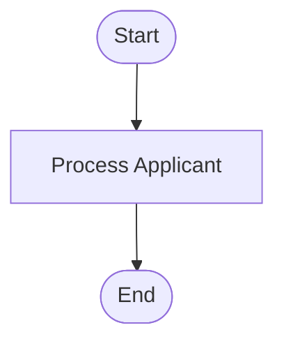

# How to Visualize the Workflow Diagrams

This guide explains multiple ways to view and interact with the Mermaid diagrams in `WORKFLOW_DIAGRAM.md`.

## Method 1: VS Code (Recommended)

### Using Markdown Preview Mermaid Support Extension

1. **Install the Extension**:
   - Open VS Code
   - Go to Extensions (Cmd+Shift+X on Mac, Ctrl+Shift+X on Windows/Linux)
   - Search for "Markdown Preview Mermaid Support"
   - Install the extension by Matt Bierner

2. **View the Diagrams**:
   - Open `workflows/WORKFLOW_DIAGRAM.md`
   - Press `Cmd+Shift+V` (Mac) or `Ctrl+Shift+V` (Windows/Linux) to open preview
   - Or right-click in the editor and select "Open Preview"
   - The diagrams will render automatically

### Alternative: Mermaid Editor Extension

1. Install "Mermaid Editor" extension
2. Open `WORKFLOW_DIAGRAM.md`
3. Use the command palette (Cmd+Shift+P / Ctrl+Shift+P)
4. Type "Mermaid: Preview" and select it

## Method 2: GitHub/GitLab

### GitHub
1. Push the repository to GitHub
2. Navigate to `workflows/WORKFLOW_DIAGRAM.md`
3. GitHub automatically renders Mermaid diagrams in markdown files
4. Click on the file to view it with rendered diagrams

### GitLab
1. Push the repository to GitLab
2. Navigate to `workflows/WORKFLOW_DIAGRAM.md`
3. GitLab also supports Mermaid rendering natively

## Method 3: Online Mermaid Live Editor

### Using Mermaid Live
1. Go to https://mermaid.live/
2. Copy a diagram code block from `WORKFLOW_DIAGRAM.md`
3. Paste it into the editor
4. The diagram renders in real-time
5. You can:
   - Export as PNG/SVG
   - Share via URL
   - Edit and experiment with the diagram

**Example**: Copy this code and paste into Mermaid Live:



## Method 4: Command Line Tools

### Using Mermaid CLI

1. **Install Mermaid CLI**:
   ```bash
   npm install -g @mermaid-js/mermaid-cli
   ```

2. **Generate PNG Images**:
   ```bash
   # Extract a diagram to a file
   # Then convert it
   mmdc -i diagram.mmd -o diagram.png
   ```

3. **Generate SVG Images**:
   ```bash
   mmdc -i diagram.mmd -o diagram.svg
   ```

## Method 5: Python Script to Extract and Render

Create a script to extract diagrams and open them in a browser:

```python
#!/usr/bin/env python3
"""Extract and visualize Mermaid diagrams."""

import re
from pathlib import Path
import webbrowser
import urllib.parse

def extract_diagrams(md_file):
    """Extract all Mermaid diagrams from markdown file."""
    content = Path(md_file).read_text()
    pattern = r'```mermaid\n(.*?)```'
    diagrams = re.findall(pattern, content, re.DOTALL)
    return diagrams

def open_in_mermaid_live(diagram_code):
    """Open diagram in Mermaid Live Editor."""
    # Encode the diagram
    encoded = urllib.parse.quote(diagram_code)
    url = f"https://mermaid.live/edit#pako:eNpVjstqw0AMRX9F6NUJ-QFvAoU0dNGVIYtSGDSjsYfMPNCMSULIv1d2mrTdCUn3HKF7xM5awhqvXx_w"
    webbrowser.open(url)

# Usage
diagrams = extract_diagrams('workflows/WORKFLOW_DIAGRAM.md')
print(f"Found {len(diagrams)} diagrams")
# Open first diagram
if diagrams:
    open_in_mermaid_live(diagrams[0])
```

## Method 6: Jupyter Notebook

If you use Jupyter notebooks:

```python
from IPython.display import display, Markdown

# Read the markdown file
with open('workflows/WORKFLOW_DIAGRAM.md', 'r') as f:
    content = f.read()

# Display it (Jupyter supports Mermaid)
display(Markdown(content))
```

## Method 7: Generate Static Images

### Using Docker

```bash
# Pull the Mermaid CLI Docker image
docker pull minlag/mermaid-cli

# Generate PNG from a diagram file
docker run --rm -v $(pwd):/data minlag/mermaid-cli \
  -i /data/diagram.mmd -o /data/diagram.png
```

## Method 8: Browser Extension

### Chrome/Edge
1. Install "Markdown Viewer" extension
2. Enable "Allow access to file URLs" in extension settings
3. Open `WORKFLOW_DIAGRAM.md` in browser
4. Diagrams render automatically

### Firefox
1. Install "Markdown Viewer Webext"
2. Configure to allow local files
3. Open the markdown file

## Recommended Workflow

For **development**:
1. Use VS Code with Markdown Preview Mermaid Support
2. Edit diagrams and see changes in real-time
3. Keep preview pane open while editing

For **presentations**:
1. Use Mermaid Live to generate high-quality SVG/PNG exports
2. Or use the CLI tool for batch generation
3. Include images in presentations or documentation

For **collaboration**:
1. Push to GitHub/GitLab for automatic rendering
2. Share Mermaid Live URLs for interactive viewing
3. Export to images for email/Slack

## Tips for Best Viewing Experience

1. **Use a wide screen**: Some diagrams are complex and benefit from horizontal space
2. **Zoom controls**: Most viewers support zoom (Cmd/Ctrl + +/-)
3. **Dark mode**: Some Mermaid viewers support dark mode themes
4. **Export options**: For printing, export to SVG for best quality

## Troubleshooting

### Diagrams Not Rendering in VS Code
- Ensure the Markdown Preview Mermaid Support extension is installed and enabled
- Try reloading VS Code
- Check that the markdown preview is using the enhanced preview (not basic)

### Syntax Errors
- Mermaid is sensitive to indentation and syntax
- Use Mermaid Live to validate syntax
- Check for missing semicolons or incorrect arrow syntax

### Performance Issues
- Large diagrams may take time to render
- Consider breaking very large diagrams into smaller ones
- Use the CLI for batch processing of many diagrams

## Interactive Features

When viewing in Mermaid Live or supported viewers:
- **Click nodes**: Some viewers allow clicking to highlight paths
- **Pan and zoom**: Use mouse/trackpad to navigate large diagrams
- **Export**: Download as PNG, SVG, or get shareable links

## Creating Your Own Diagrams

To add new diagrams to the workflow:

1. Edit `WORKFLOW_DIAGRAM.md`
2. Add a new section with a code block:
   ````markdown
   ## My New Diagram
   
   ```mermaid
   graph TD
       A[Start] --> B[Process]
       B --> C[End]
   ```
   ````
3. Preview to verify it renders correctly
4. Commit and push

## Resources

- **Mermaid Documentation**: https://mermaid.js.org/
- **Mermaid Live Editor**: https://mermaid.live/
- **Syntax Guide**: https://mermaid.js.org/intro/syntax-reference.html
- **Examples**: https://mermaid.js.org/ecosystem/integrations.html

## Quick Reference: Diagram Types Used

| Type | Syntax | Use Case |
|------|--------|----------|
| Flowchart | `graph TD` or `flowchart TD` | Process flows, decision trees |
| Sequence | `sequenceDiagram` | Agent interactions, API calls |
| Class | `classDiagram` | Object relationships |
| State | `stateDiagram-v2` | State machines |
| ER | `erDiagram` | Database schemas |

## Example: Viewing in VS Code

1. Open `workflows/WORKFLOW_DIAGRAM.md` in VS Code
2. Split editor (View → Editor Layout → Split Right)
3. In the right pane, open preview (Cmd+Shift+V)
4. Edit in left pane, see updates in right pane
5. Use the preview toolbar to zoom and navigate

This gives you a live editing experience with instant feedback!