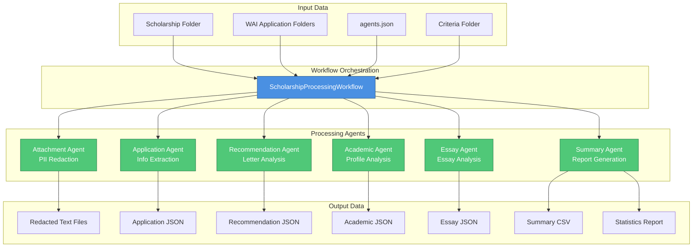
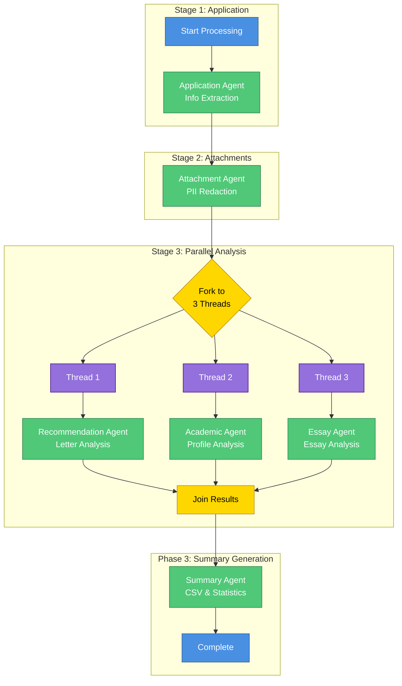
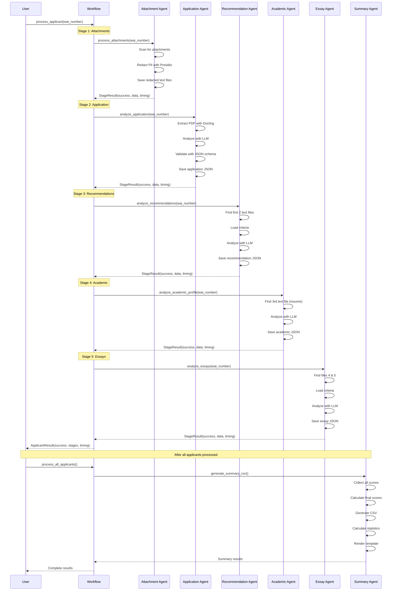
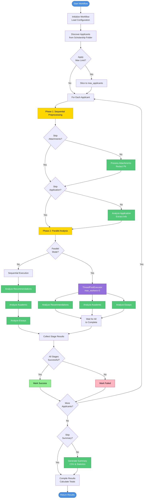
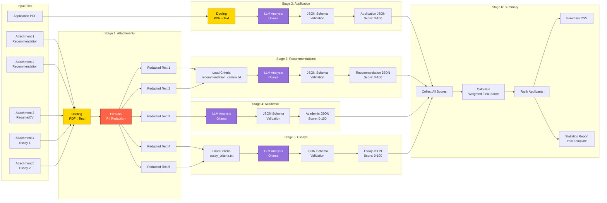
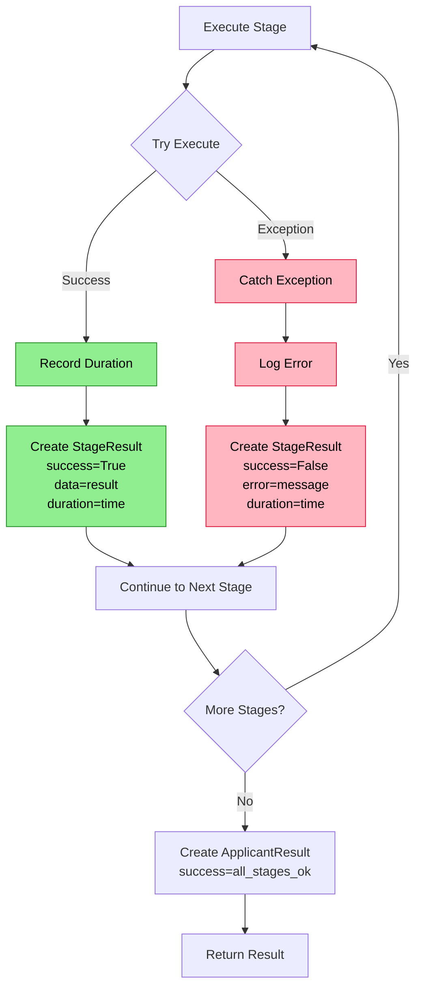
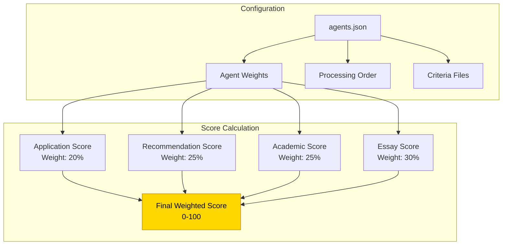

# Scholarship Processing Workflow Diagrams

## Overall System Architecture

## Parallel Processing Architecture

## Sequential Processing Flow

## Batch Processing Flow (with Parallel Execution)

## Data Flow Diagram

## Error Handling Flow

## Configuration and Weights

## Usage Patterns

```mermaid
graph TD
    subgraph "Pattern 1: Single Applicant"
        P1[workflow.process_applicant<br/>'75179']
        P1 --> R1[ApplicantResult<br/>5 stages<br/>timing info]
    end
    
    subgraph "Pattern 2: Batch Processing"
        P2[workflow.process_all_applicants<br/>max_applicants=10]
        P2 --> R2[Batch Results<br/>10 applicants<br/>summary CSV<br/>statistics]
    end
    
    subgraph "Pattern 3: Resume Processing"
        P3["workflow.process_all_applicants<br/>skip_stages=attachments"]
        P3 --> R3[Batch Results<br/>skipped stage 1<br/>faster execution]
    end
    
    subgraph "Pattern 4: Specific Applicants"
        P4["workflow.process_all_applicants<br/>wai_numbers=specific list"]
        P4 --> R4[Batch Results<br/>2 specific applicants]
    end
    
    style P1 fill:#4A90E2,stroke:#2E5C8A,color:#fff
    style P2 fill:#4A90E2,stroke:#2E5C8A,color:#fff
    style P3 fill:#4A90E2,stroke:#2E5C8A,color:#fff
    style P4 fill:#4A90E2,stroke:#2E5C8A,color:#fff
```

